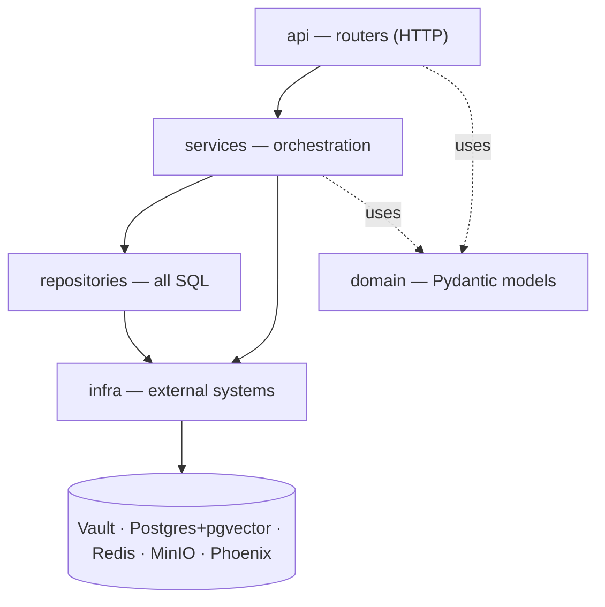
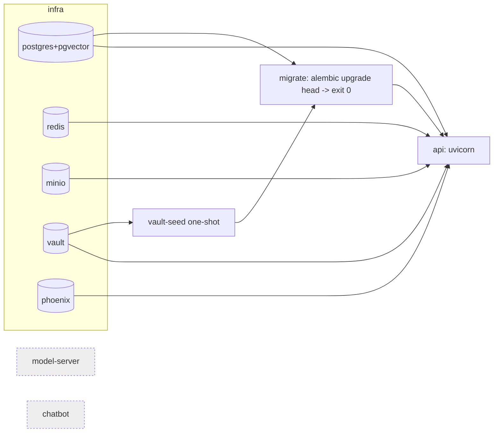

# Architecture

Single-project layered FastAPI service (Rule 1). A request only ever flows
**downward**; a layer never imports a layer above it.

## Layers

1. **api** (`app/api/routers/`) — HTTP surface. One file per resource;
   `routers/__init__.py` aggregates them into one `APIRouter`. Calls
   **services** only.
2. **services** (`app/services/`) — orchestration / use cases (e.g.
   `health_service` probes each dependency, one OTel span per check).
3. **repositories** (`app/repositories/`) — the *only* place SQL lives;
   returns domain types, never leaks ORM rows upward.
4. **domain** (`app/domain/`) — Pydantic models (`HealthReport`,
   `DependencyStatus`), distinct from any ORM model.
5. **infra** (`app/infra/`) — one file per external system (Vault, DB,
   Redis, MinIO, tracing, request-context, log redaction; plus Day 2+
   stubs `anthropic_client`, `model_server_client`).

## Compose topology

`migrate` and `api` share one image (entrypoint switches on command).
Boot order is enforced by healthchecks + completion gates:

`model-server` and `chatbot` are declared with `profiles: [later]` — the
compose file documents the final shape while only Day 1 services run.

## Refuse-to-boot (Rule 4)

`app/main.py` lifespan bootstraps Vault → DB → Redis → MinIO → (tracing is
instrumented at import). Vault unreachable, a missing required Vault key,
Postgres-after-retries, or MinIO-after-retries each emits one
`REFUSE TO BOOT: …` line and propagates so the container exits non-zero.
Redis down is tolerated and surfaces as `/health` `degraded`.
