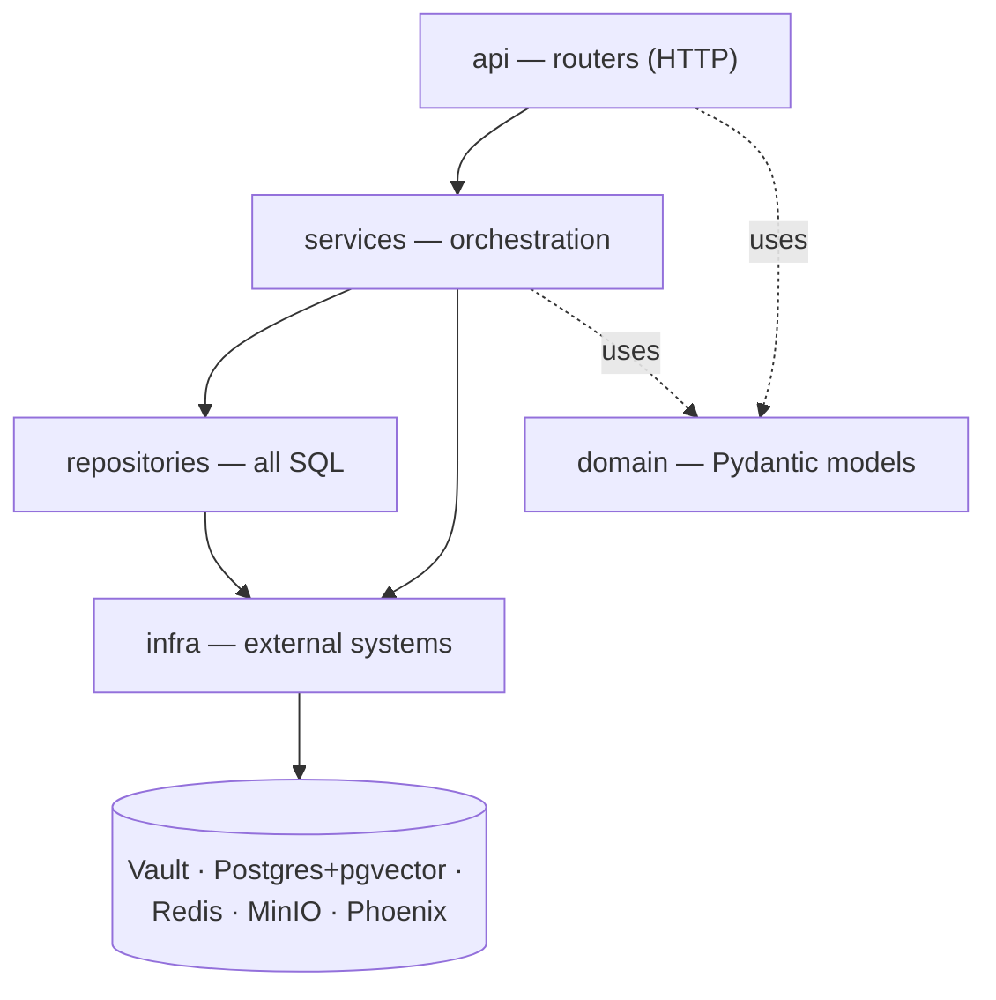
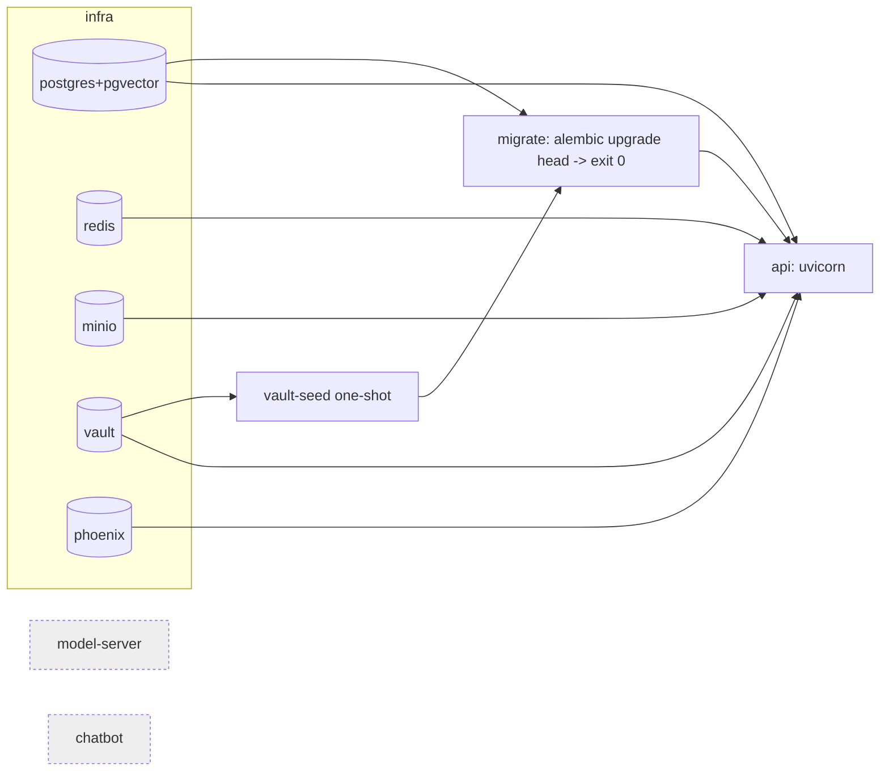

# Architecture

Single-project layered FastAPI service (Rule 1). A request only ever flows
**downward**; a layer never imports a layer above it.

## Layers

1. **api** (`app/api/routers/`) — HTTP surface. One file per resource;
   `routers/__init__.py` aggregates them into one `APIRouter`. Calls
   **services** only.
2. **services** (`app/services/`) — orchestration / use cases (e.g.
   `health_service` probes each dependency, one OTel span per check).
3. **repositories** (`app/repositories/`) — the *only* place SQL lives;
   returns domain types, never leaks ORM rows upward.
4. **domain** (`app/domain/`) — Pydantic models (`HealthReport`,
   `DependencyStatus`), distinct from any ORM model.
5. **infra** (`app/infra/`) — one file per external system (Vault, DB,
   Redis, MinIO, tracing, request-context, log redaction; plus Day 2+
   stubs `anthropic_client`, `model_server_client`).

## Compose topology

`migrate` and `api` share one image (entrypoint switches on command).
Boot order is enforced by healthchecks + completion gates:

`model-server` and `chatbot` are declared with `profiles: [later]` — the
compose file documents the final shape while only Day 1 services run.

## Refuse-to-boot (Rule 4)

`app/main.py` lifespan bootstraps Vault → DB → Redis → MinIO → tracing
(instrumented at import) → RAG corpus check → chatbot tables check.
Vault unreachable, a missing required Vault key (now including
`auth_jwt_secret`), Postgres-after-retries, **Redis-unreachable** (Part 1
promoted this from degraded to fatal), MinIO-after-retries, the RAG corpus
state failing, or any chatbot table (`users` / `chatbot_memories` /
`widgets`) absent each emits one `REFUSE TO BOOT: …` line and propagates
so the container exits non-zero.

## Chatbot Part 1 — Foundations layer

Part 1 extends the layered tree with authentication, persistent memory,
short-term memory, and two upstream services:

- **Auth.** `app/api/routers/auth.py` (fastapi-users register / login /
  logout / users), `app/infra/auth_backend.py` (JWT-cookie strategy,
  signing key from Vault key `auth_jwt_secret`), `app/services/auth_service.py`
  (`require_admin` dependency). A parallel async SQLAlchemy engine in
  `app/infra/database_async.py` is scoped to the `users` table; every
  other repository still uses the sync engine.
- **Long-term memory.** `chatbot_memories` (pgvector(768), IVFFlat cosine
  partial index) holds maintainer-scoped memories.
  `app/services/tools/write_memory_tool.py` and `recall_memory_tool.py`
  are the typed-outcome primitives the Part 2 agent will compose; they
  refuse for widget-actor contexts.
- **Short-term memory.** `app/services/short_term_memory_service.py` keeps
  a per-conversation message window in Redis with TTL (1 h widget, 24 h
  authed). Content is run through `redact_for_persistence` before
  encoding (research R6).
- **Upstream services for the Part 2 agent.** `app/services/ner_service.py`
  (Anthropic Sonnet 4 → strict 4-bucket JSON) and
  `app/services/summarize_service.py` (Anthropic Haiku via existing
  `prompts/summarizer.md`). Each exposed at `/ner` / `/summarize` with
  programmatic F1 and rubric-judge eval gates respectively.
- **Audit.** `audit_log` (evolved additively in migration 0003) records
  every memory write, widget create, widget revoke, and role change.
  Append-only at the role level (`REVOKE UPDATE, DELETE`) and at the
  repository level (`AuditLogImmutableError`).
